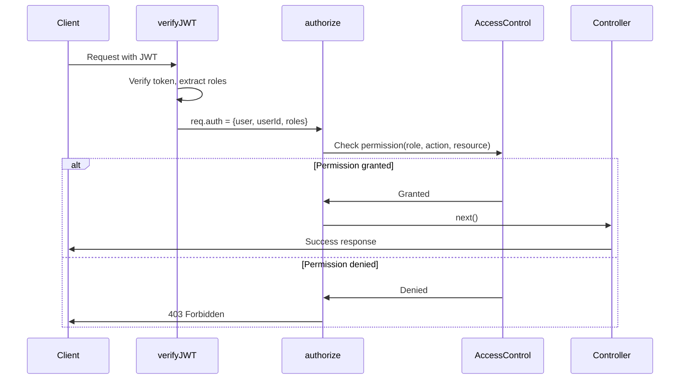

# AccessControl RBAC Implementation Plan

## Overview

Implement role-based authorization using the AccessControl library with two roles:

- **Admin**: Full CRUD on any user profile
- **Customer**: Read-only access to own profile

## Implementation Steps

### 1. Update Auth Model

**File**: [`backend/modules/auth/auth.model.js`](backend/modules/auth/auth.model.js)

- Change default role from `["User"]` to `["Customer"]`
- This ensures new users are customers by default

### 2. Update JWT Middleware

**File**: [`backend/middleware/verifyJWT.js`](backend/middleware/verifyJWT.js)

- Currently only extracts `username` and `userId` to `req.auth`
- Need to add `roles` to the decoded token and attach to `req.auth`
- This allows authorization middleware to check user roles

### 3. Update Token Generation

**File**: [`backend/utils/generateTokens.js`](backend/utils/generateTokens.js)

- Include `roles` field in JWT payload when signing tokens
- Ensures roles are available when tokens are verified

### 4. Create AccessControl Roles Configuration

**New File**: `backend/configuration/roles.js`

- Define AccessControl permissions for Admin and Customer roles
- Admin: `createAny`, `readAny`, `updateAny`, `deleteAny` on `userProfile`
- Customer: `readOwn` on `userProfile` (own data only)

### 5. Create Authorization Middleware

**New File**: `backend/middleware/authorize.js`

- Create `authorize(action, resource)` middleware factory
- Checks if user's role has permission using AccessControl
- Returns 403 Forbidden if permission denied
- For "Own" permissions, validates that the user can only access their own data

### 6. Update Middleware Index

**File**: [`backend/middleware/index.js`](backend/middleware/index.js)

- Export the new `authorize` middleware for easy import

### 7. Update User Routes

**File**: [`backend/modules/users/user.routes.js`](backend/modules/users/user.routes.js)**Current routes** (customers accessing own profile):

- `GET /users/profile` → `authorize("readOwn", "userProfile")`
- `PATCH /users/profile` → `authorize("updateOwn", "userProfile")`
- `DELETE /users/account` → `authorize("deleteOwn", "userProfile")`

**New admin routes** (admins managing any user):

- `GET /users` → List all users (admin only)
- `GET /users/:id` → Get any user (admin only)
- `PATCH /users/:id` → Update any user (admin only)
- `DELETE /users/:id` → Delete any user (admin only)

### 8. Create Admin User Controller Methods

**File**: [`backend/modules/users/user.controller.js`](backend/modules/users/user.controller.js)

- Add new controller methods for admin operations:
- `getAllUsers()` - List all users
- `getUserById()` - Get specific user
- `updateUserById()` - Update specific user
- `deleteUserById()` - Delete specific user

### 9. Update User Service Layer

**File**: [`backend/modules/users/user.service.js`](backend/modules/users/user.service.js)

- Add service methods to support admin operations
- Reuse existing repository methods or create new ones as needed

## Key Files to Modify/Create

| File | Action | Purpose ||------|--------|---------|| `configuration/roles.js` | **Create** | AccessControl role definitions || `middleware/authorize.js` | **Create** | Authorization middleware || `middleware/verifyJWT.js` | **Modify** | Add roles to req.auth || `middleware/index.js` | **Modify** | Export authorize middleware || `modules/auth/auth.model.js` | **Modify** | Change default role to Customer || `utils/generateTokens.js` | **Modify** | Include roles in JWT || `modules/users/user.routes.js` | **Modify** | Add authorization and admin routes || `modules/users/user.controller.js` | **Modify** | Add admin controller methods || `modules/users/user.service.js` | **Modify** | Add admin service methods |

## Authorization Flow

## Example Usage

After implementation, routes will work as follows:**Customer user** (role: Customer):

- ✅ `GET /users/profile` - Read own profile
- ✅ `PATCH /users/profile` - Update own profile