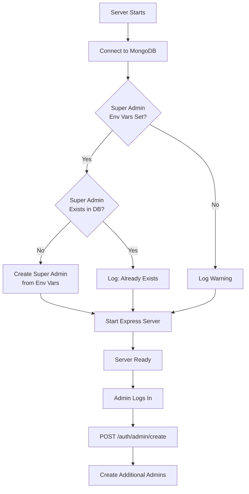

# Complete Admin User Creation System

## Overview

Implement a comprehensive admin management system with two complementary features:

1. **Environment Variable Super Admin**: Auto-create/ensure a super admin exists on every server startup using credentials from `.env`
2. **Admin-Only Endpoint**: Allow existing admins to create additional admin users via a protected API endpoint

This ensures you always have at least one admin account (from env vars) and admins can create more without database access.---

## Part 1: Environment Variable Super Admin

### 1.1 Add Environment Variables

**File:** `.env` (create if doesn't exist, or add to existing)Add super admin credentials:

```env
SUPER_ADMIN_USERNAME=superadmin
SUPER_ADMIN_PASSWORD=ChangeThisSecurePassword123!
SUPER_ADMIN_EMAIL=admin@yourdomain.com
```

**Security Note:** Use a strong password and keep `.env` in `.gitignore`.

### 1.2 Create Super Admin Initialization Service

**File:** [`backend/modules/auth/initSuperAdmin.js`](backend/modules/auth/initSuperAdmin.js) (NEW FILE)Create a utility function that runs on startup:

```javascript
import bcrypt from "bcryptjs";
import AuthUser from "./auth.model.js";
import logger from "../../utils/logger.js";

export const ensureSuperAdminExists = async () => {
  try {
    const username = process.env.SUPER_ADMIN_USERNAME;
    const password = process.env.SUPER_ADMIN_PASSWORD;
    const email = process.env.SUPER_ADMIN_EMAIL;

    if (!username || !password) {
      logger.warn("Super admin credentials not set in environment variables");
      return;
    }

    // Check if super admin already exists
    const existingAdmin = await AuthUser.findOne({ username }).exec();

    if (existingAdmin) {
      logger.info(`Super admin '${username}' already exists`);
      return;
    }

    // Create super admin
    const hashedPassword = await bcrypt.hash(password, 10);
    
    await AuthUser.create({
      username,
      password: hashedPassword,
      email,
      roles: ["admin"],
      isEmailVerified: true
    });

    logger.info(`Super admin '${username}' created successfully`);
  } catch (error) {
    logger.error("Failed to ensure super admin exists:", error);
  }
};
```


### 1.3 Call Initialization on Server Startup

**File:** [`backend/server.js`](backend/server.js)Import and call the super admin initialization after DB connection:

```javascript
import { ensureSuperAdminExists } from "./modules/auth/initSuperAdmin.js";

mongoose.connection.once("open", async () => {
  logger.info("Connected to MongoDB");
  
  // Ensure super admin exists
  await ensureSuperAdminExists();
  
  app.listen(PORT, () => {
    logger.info(`Server is running on port ${PORT}`);
  });
});
```

---

## Part 2: Admin-Only Endpoint to Create Admins

### 2.1 Update Access Control Permissions

**File:** [`backend/configuration/roles.js`](backend/configuration/roles.js)Add permission for admins to create other admin accounts:

```javascript
ac.grant("admin")
  .extend("customer")
  .createAny("profile")
  .readAny("profile")
  .updateAny("profile")
  .createAny("admin");  // NEW: Allow admins to create other admins
```


### 2.2 Create Validation Schema

**File:** [`backend/modules/auth/auth.schema.js`](backend/modules/auth/auth.schema.js)Add a new Zod schema for creating admin users:

```javascript
export const createAdminSchema = z.object({
  body: z.object({
    username: z.string().trim()
      .min(3, "Username must be at least 3 characters")
      .max(30, "Username must be at most 30 characters")
      .regex(/^[a-zA-Z0-9_]+$/, "Username can contain letters, numbers, and underscores only"),
    password: z.string()
      .min(8, "Password must be at least 8 characters")
      .max(100),
    email: z.string().email().optional()
  }).strict()
});
```


### 2.3 Create Service Function

**File:** [`backend/modules/auth/auth.service.js`](backend/modules/auth/auth.service.js)Add a new function to create admin users:

```javascript
export const createAdminUser = async ({ username, password, email }) => {
  const found = await AuthRepository.findByUsername(username);
  if (found) {
    throw new DuplicateUserError();
  }

  if (email) {
    const emailExists = await AuthRepository.findByEmail(email);
    if (emailExists) {
      throw new Error("EMAIL_ALREADY_EXISTS");
    }
  }

  const hashedPwd = await bcrypt.hash(password, 10);
  
  const user = await AuthRepository.createUser({
    username,
    password: hashedPwd,
    email,
    roles: ["admin"]
  });

  return user;
};
```


### 2.4 Create Controller Function

**File:** [`backend/modules/auth/auth.controller.js`](backend/modules/auth/auth.controller.js)Add controller to handle the admin creation request:

```javascript
export const createAdmin = async (req, res, next) => {
  try {
    const newAdmin = await authService.createAdminUser(req.body);
    
    return res.status(201).json({
      message: "Admin user created successfully",
      admin: {
        id: newAdmin._id,
        username: newAdmin.username,
        email: newAdmin.email,
        roles: newAdmin.roles,
        createdAt: newAdmin.createdAt
      }
    });
  } catch (err) {
    if (err.message === "EMAIL_ALREADY_EXISTS") {
      return res.status(409).json({ message: "Email already exists" });
    }
    next(err);
  }
};
```


### 2.5 Add Protected Route

**File:** [`backend/modules/auth/auth.routes.js`](backend/modules/auth/auth.routes.js)Add the new route with authentication and authorization:

```javascript
import { authorize } from "../../middleware/index.js";
import { createAdminSchema } from "./auth.schema.js";

// Admin-only routes (add after protected session routes, before export)
router.post(
  "/admin/create",
  verifyJWT,
  authorize("createAny", "admin"),
  validate(createAdminSchema),
  authController.createAdmin
);
```

---

## How It Works Together




## Bootstrap Process

1. **First Time Setup:**

- Set super admin credentials in `.env`
- Start server → Super admin auto-created
- Log in with super admin credentials
- Use endpoint to create more admins if needed

2. **Subsequent Startups:**

- Server checks if super admin exists
- If exists: logs message and continues
- If missing: recreates from env vars
- Ensures at least one admin always exists

## API Endpoint Details

**Route:** `POST /auth/admin/create`**Auth:** Bearer token required (admin role only)**Request Body:**

```json
{
  "username": "newadmin",
  "password": "SecurePassword123",
  "email": "admin@example.com"
}
```

**Success Response (201):**

```json
{
  "message": "Admin user created successfully",
  "admin": {
    "id": "507f1f77bcf86cd799439011",
    "username": "newadmin",
    "email": "admin@example.com",
    "roles": ["admin"],
    "createdAt": "2026-01-12T10:30:00.000Z"
  }
}
```

**Error Responses:**

- 401: Unauthorized (no/invalid token)
- 403: Forbidden (not an admin)
- 400: Validation error (invalid input)
- 409: Conflict (username or email exists)

## Files to Create/Modify

**New Files:**

1. [`backend/modules/auth/initSuperAdmin.js`](backend/modules/auth/initSuperAdmin.js) - Super admin initialization logic

**Modified Files:**

1. [`.env`](.env) - Add super admin credentials
2. [`backend/server.js`](backend/server.js) - Call ensureSuperAdminExists on startup
3. [`backend/configuration/roles.js`](backend/configuration/roles.js) - Add createAny("admin") permission
4. [`backend/modules/auth/auth.schema.js`](backend/modules/auth/auth.schema.js) - Add createAdminSchema
5. [`backend/modules/auth/auth.service.js`](backend/modules/auth/auth.service.js) - Add createAdminUser function
6. [`backend/modules/auth/auth.controller.js`](backend/modules/auth/auth.controller.js) - Add createAdmin controller
7. [`backend/modules/auth/auth.routes.js`](backend/modules/auth/auth.routes.js) - Add POST /admin/create route

## Security Considerations

- Super admin password should be strong and unique
- Keep `.env` file out of version control (in `.gitignore`)
- The super admin is only created if it doesn't exist (idempotent)